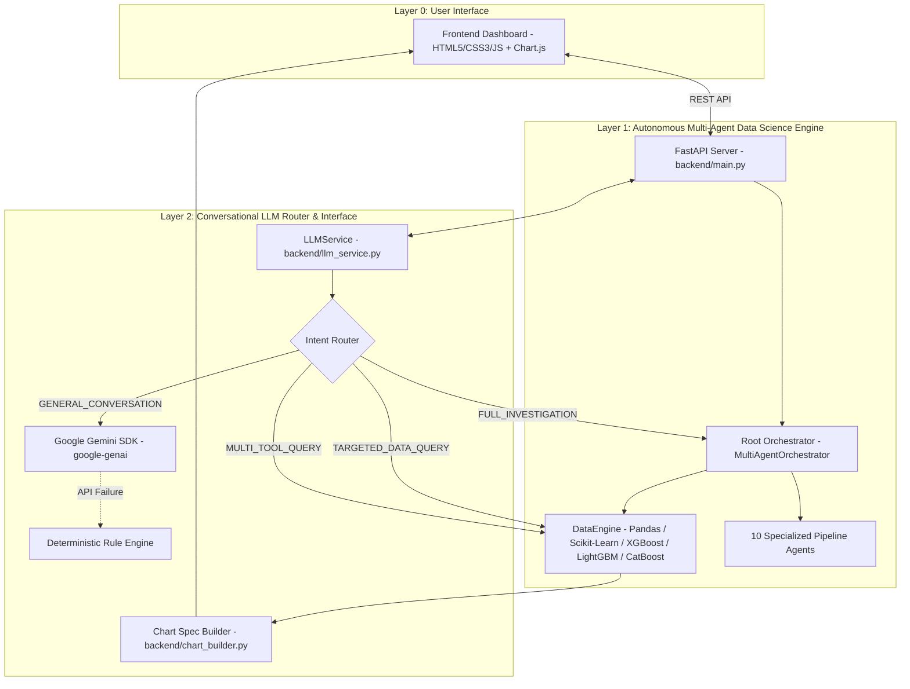

# ⚡ InsightForge — Autonomous AI Data Scientist & Conversational Analysis Platform

**InsightForge** is an end-to-end, multi-agent autonomous data science engine and conversational AI assistant. It transforms raw tabular datasets (`.csv`) into structured statistical insights, candidate machine learning benchmarks, feature impact interpretations, and interactive data visualisations.

By combining an autonomous multi-agent analytical workflow (Layer 1) with a conversational LLM reasoning and intent-routing layer (Layer 2), InsightForge enables both automated full-spectrum dataset investigations and interactive natural-language data exploration.

---

## 🚀 Live Demo

**Live demo coming soon.**

---

## 🏗️ Core Architecture

InsightForge is engineered around a **Two-Layer Architecture** that strictly decouples analytical data processing from conversational presentation.



### Analytical Engine & Multi-Agent Pipeline

The 11 core components executing the analytical pipeline (`backend/agents.py`):

| Component / Agent | Role & Function |
| :--- | :--- |
| **Root Orchestrator** | Master manager coordinating task planning, intent classification, & pipeline allocation. |
| **Data Agent** | Ingests CSV schema, profiles data types, and computes baseline dataset metrics. |
| **Data Quality Agent** | Audits missingness, duplicate rows, constant features, cardinality, & outlier spikes. |
| **Analysis Agent (EDA)** | Computes exploratory statistics, correlation matrices, & target column distributions. |
| **Hypothesis Agent** | Formulates & ranks testable domain hypotheses using a statistical evidence matrix. |
| **Task Classifier Agent** | Detects machine learning task categories (`Classification` vs. `Regression`). |
| **Model Selection Agent** | Analyzes data scale & cardinality to select candidate algorithms and metric strategies. |
| **Experiment Agent** | Executes 5-Fold Cross-Validation benchmarking across candidate ML models. |
| **Explainability Agent** | Calculates SHAP feature attribution scores to identify key predictive drivers. |
| **Answer Agent** | Synthesizes deterministic computed findings into structured natural language answers. |
| **Report Agent** | Compiles executive investigation summaries in formatted Markdown. |

---

## 🧪 Machine Learning & Explainability

InsightForge evaluates up to **29 machine learning algorithms** across 4 problem categories:

- **Classification (11 Models):** XGBoost, LightGBM, CatBoost, Random Forest, Extra Trees, Logistic Regression, SVM, KNN, Naive Bayes, HistGradientBoosting, Decision Tree.
- **Regression (11 Models):** Linear, Ridge, Lasso, ElasticNet, Random Forest, Extra Trees, SVR, XGBoost, LightGBM, CatBoost, HistGradientBoosting.
- **Clustering (4 Models):** K-Means, DBSCAN, Hierarchical, Gaussian Mixture (GMM).
- **Anomaly Detection (3 Models):** Isolation Forest, One-Class SVM, Local Outlier Factor (LOF).
- **SHAP Feature Importance:** Computes mathematical feature attributions and directional impacts for winning models.

---

## 🏃 Quick Start (Local Run)

1. **Clone repository:**
   ```bash
   git clone https://github.com/your-username/insightforge.git
   cd insightforge
   ```

2. **Install dependencies:**
   ```bash
   pip install -r requirements.txt
   ```

3. **Start local dev server:**
   ```bash
   python -m uvicorn backend.main:app --host 127.0.0.1 --port 8000
   ```
   Open **`http://127.0.0.1:8000`** in your browser.

---

## 🚀 Render Deployment (Native Python Web Service)

InsightForge is ready to deploy on **Render** as a native Python Web Service:

1. **Push code to GitHub.**
2. **Create a New Web Service** on [Render](https://dashboard.render.com/).
3. **Configure Build & Start Commands:**
   - **Build Command:** `pip install -r requirements.txt`
   - **Start Command:** `gunicorn -k uvicorn.workers.UvicornWorker backend.main:app`
4. **Add Environment Variables:**
   - `GEMINI_API_KEY`: `<your_gemini_api_key>`
   - `GEMINI_MODEL_NAME`: `gemini-3.6-flash`

---

## 🔐 Environment Variables

| Variable Name | Description | Default Value | Required |
| :--- | :--- | :--- | :--- |
| `GEMINI_API_KEY` | Google Gemini API key for conversational Q&A | `""` | Optional *(Deterministic rule fallback active if absent)* |
| `GEMINI_MODEL_NAME` | Gemini model identifier | `"gemini-3.6-flash"` | Optional |
| `PORT` | Server binding port (set dynamically by host) | `8000` | Optional |

